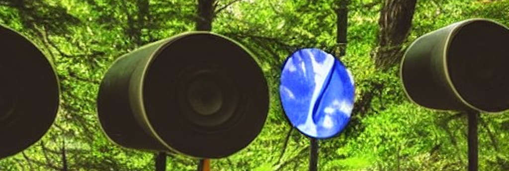

---
# Feel free to add content and custom Front Matter to this file.
# To modify the layout, see https://jekyllrb.com/docs/themes/#overriding-theme-defaults

layout: home
---
{:class="img-responsive"}

Come curious and we’ll supply the coffees and conversation to a new fortnightly meet-up at Fuse Art Space for people that work with sound and those that might want to.

In association with [Play Music](https://playmusicproject.org.uk/), we are inviting people of any level of ability, hobbyists and career musicians alike, to join us on alternative Wednesday lunchtimes and evenings. 

## FREE workshops on multi-channel sound

Come to a session to find out how to use our 8 speaker ambisonic set up.

We have two FREE workshops on multi-channel sound (very limited spaces)

- For womxn & minority gender only - [Sat 1st October 12:30 - 2:30pm (book tickets)](https://www.skiddle.com/whats-on/Bradford/Fuse-Art-Space/Artist-Talk-Sophie-Cooper/36172261/)

 - For anyone - [Sat 29th October, 1pm - 3pm (book tickets)](https://www.skiddle.com/whats-on/Bradford/Fuse-Art-Space/Tech-Talk--Ben-Eyes/36172281/)

## Meetings

Our meetings are usually held at Fuse Arts Space on the:

* FIRST Wednesday of the month at lunchtime, and
* THIRD Wednesday of the month in the evening.

### Upcoming meetings/events

* Saturday 1st October 2022 - Multi-channel sound workshop
* Wednesday 5th October 2022, 12noon - 2pm  
**NB: NOT AT FUSE - Meet at Bradford Uni.** More details to follow.

* Wednesday 19th October 2022, 5.30pm -7.30pm
* Saturday 29th October 2022 - Multi-channel sound workshop
* Wednesday 2nd November 2022, 12noon - 2pm
* Wednesday 16th November 2022, 5.30pm -7.30pm
* Wednesday 7th December 2022, 12noon - 2pm
* Wednesday 21st December 2022, 5.30pm -7.30pm


